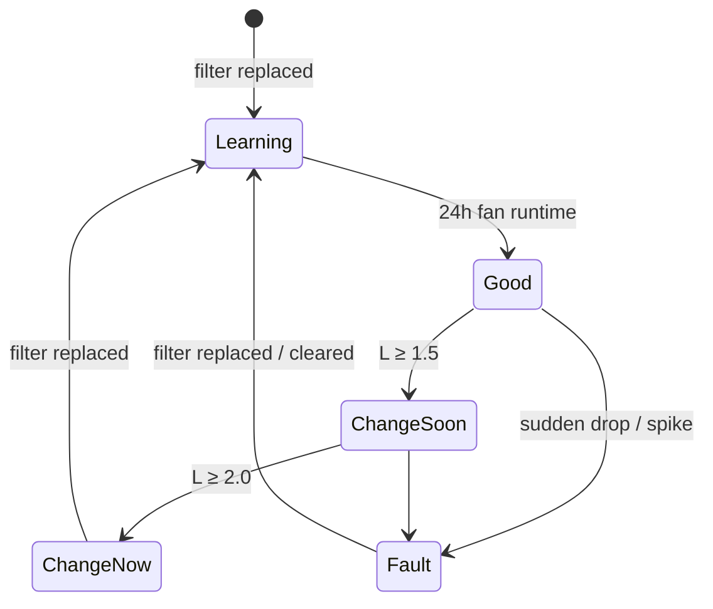

# FilterSense — ESP32 Air-Filter Health Monitor

> A small ESP32 kit that watches the pressure drop across an HVAC / air-handler filter and tells you **when it needs changing** — and **when something is wrong** (torn, missing, bypassed, or collapsed filter).

*Working name — rename freely.*

| | |
|---|---|
| **Status** | Prototype / design stage |
| **Team** | Vincent Ooi · Avi Inger |
| **Contact** | support@snowpizzas.com |
| **MCU** | ESP32-C6 (Wi-Fi 6 · BLE 5 · Thread/Zigbee) |
| **Prototype board** | Waveshare ESP32-C6-LCD-1.47 (built-in 1.47" display + RGB LED) |

---

## Why this works

A filter is a resistance in the airflow path. As it loads with dust, that resistance climbs, so the **static pressure difference (ΔP) between the upstream and downstream side rises**. Measuring ΔP directly is the same principle commercial building systems use (a "filter gauge" / magnehelic across the filter bank) — this kit makes it cheap, connected and self-calibrating.

ΔP also reveals faults that a calendar reminder never will:

| What you see | What it usually means |
|---|---|
| ΔP slowly rising over weeks | Normal loading → **change soon** |
| ΔP ≥ ~2× the clean baseline, or above the filter's rated final resistance | **Change now** |
| ΔP suddenly **drops** well below baseline with the fan running | Filter torn, blown out, missing, or air bypassing around the frame → **fault** |
| ΔP suddenly **spikes** | Collapsed / wet / blocked filter, closed damper → **fault** |
| ΔP negative | Pressure tubes swapped → **install fault** |
| PM2.5 downstream rising while ΔP is normal *(Pro tier)* | Air is getting past the filter → **fault** |

---

## Recommended sensors

### Core kit (MVP)

| # | Part | Role | Interface | Why this one | Approx. cost |
|---|---|---|---|---|---|
| 1 | **Sensirion SDP810-500Pa** | Differential pressure across the filter (the key sensor) | I²C `0x25` | Digital, temperature-compensated, calibrated, **no zero-point drift**, ±500 Pa range covers clean→clogged residential & light-commercial filters with sub-Pa resolution. Has two 5 mm hose barbs — one tube upstream, one downstream. | $30–45 |
| 2 | **Sensirion SHT40** (breakout) | Air temperature & humidity | I²C `0x44` | Air-density compensation, flags high-RH conditions (wet filters load faster), and gives the app a "comfort" readout for free. | ~$6 |
| 3 | Onboard **RGB LED** (GPIO8) + **1.47" LCD** | Local status | — | Green / amber / red at a glance; screen shows ΔP, filter life %, and alerts. | included |
| 4 | Passive **piezo buzzer** | Local audible alert | GPIO | Optional chirp on "change now" / fault. | <$1 |
| 5 | Push button (or the onboard **BOOT** button) | "I just replaced the filter" → re-learn baseline | GPIO | The single most important UX action. | <$1 |

> **Range note:** for low-resistance fiberglass filters (clean ΔP ≈ 10–25 Pa) the **SDP810-125Pa** gives even finer resolution. For most pleated MERV 8–13 filters, the 500 Pa version is the safer default.

### Pro tier (fault confirmation)

| Part | Role | Interface | Notes |
|---|---|---|---|
| **Sensirion SPS30** | PM2.5 / PM10 **downstream** of the filter | I²C `0x69` (SEL→GND) | Confirms bypass / tears independent of pressure. Needs 5 V supply; logic is 3.3 V-safe. A second one upstream (on UART, or via a TCA9548A I²C mux) lets you compute **real filtration efficiency**. |
| **LIS3DH** accelerometer (optional) | Blower-vibration "fan running" confirmation | I²C `0x18` | Only needed if ΔP-based fan detection proves unreliable on very low-resistance systems. |

### Budget alternative (not recommended for v1)

**2 × Bosch BMP390** absolute-pressure sensors (I²C `0x76` + `0x77`), one each side of the filter, subtracting the readings. Relative accuracy is about ±3 Pa, so it can work — but two separately-drifting sensors need periodic re-zeroing (do it when the fan is off). Good for a sub-$20 BOM experiment; the SDP810 is the production answer.

### Sensors to avoid

- **BME280 / BMP280** as a ΔP pair — relative accuracy (~±12 Pa) is too coarse; the whole clean→dirty swing can be 25–125 Pa.
- **MPXV7002DP** and similar analog ±2 kPa sensors — needs 5 V, and the ESP32 ADC noise (~10–20 mV) turns into 10–20 Pa of noise. Far too blunt for this job.
- **Hot-wire / thermal anemometers alone** — velocity depends on the duct, blower speed and dampers; it's a weak proxy for filter loading.

---

## Prototype circuit

See **[`hardware/filtersense-prototype-schematic.svg`](hardware/filtersense-prototype-schematic.svg)**.

Everything shares **one I²C bus**; no address conflicts.

### Wiring (Waveshare ESP32-C6-LCD-1.47)

| Board pin | Connects to | Notes |
|---|---|---|
| **5V** (USB) | SPS30 VDD | Pro tier only |
| **3V3** | SDP810 VDD, SHT40 VIN, 4.7 kΩ pull-ups | |
| **GND** | All sensor GND, SPS30 SEL, buzzer −, button | |
| **GPIO18** | I²C **SDA** → all sensors | 4.7 kΩ to 3V3 (skip if your breakouts already have pull-ups — fit only one set) |
| **GPIO19** | I²C **SCL** → all sensors | 4.7 kΩ to 3V3 |
| **GPIO2** | Piezo buzzer via 100 Ω | Driven with LEDC PWM (~2.7 kHz) |
| **GPIO3** | External "filter replaced" button → GND | Internal pull-up; or use onboard BOOT (GPIO9) long-press after boot |
| GPIO8 | Onboard RGB LED | Already wired on the board |
| GPIO4/5/6/7/14/15/21/22 | **Reserved** — LCD + TF card | Don't reuse |

> Pin choices assume the header broke-out pins on the Waveshare board; double-check against your board's silkscreen before soldering. Any free GPIO can be remapped in `config.h`.

### I²C address map

| Address | Device |
|---|---|
| `0x18` | LIS3DH (optional) |
| `0x25` | SDP810 |
| `0x44` | SHT40 |
| `0x69` | SPS30 (optional) |
| `0x76` / `0x77` | BMP390 pair (budget alternative only) |

### Pneumatic install (the part that makes or breaks accuracy)

```
      AIRFLOW  ──────────────►
   ┌───────────────┬──┬───────────────┐
   │   upstream    │▓▓│  downstream   │   duct / filter rack
   │   (dirty)  ●  │▓▓│  ●   (clean)  │
   └────────────┼──┴──┴──┼────────────┘
                │  FILTER │
        tube "+"│         │tube "−"
                └──► SDP810 ◄──┘
```

- **"+" port = upstream** (the side air enters the filter), **"−" port = downstream**. Swapped tubes give negative ΔP — the firmware detects and reports this.
- Use static-pressure taps: 1/4" tube pushed through a rubber grommet, **flush with the duct wall and perpendicular to airflow** (never pointing into the airstream). A proper static-pressure tip is better if you have one.
- Place taps 5–15 cm from the filter face, away from elbows and the blower inlet.
- Silicone tubing ~4 mm ID, **equal lengths both sides**, ≤ 2 m, with a small drip loop so condensation can't pool in the sensor.
- Mount the electronics **outside** the duct, below or beside the taps.

---

## How detection works

1. **Sample** ΔP, temperature and RH at 1 Hz; smooth with an exponential moving average.
2. **Fan detection** — the blower is considered *ON* when ΔP stays above ~8 Pa for 10 s. All filter decisions are made only while the fan is running; readings with the fan off are used to re-zero the sensor/zero-check the tubing.
3. **Baseline learning** — after the user presses *"Filter replaced"*, the device takes the **median ΔP over the first 24 h of fan runtime** as `ΔP_clean`.
4. **Loading ratio** `L = ΔP_now / ΔP_clean`, evaluated on a rolling 30-minute fan-on window so a single gust never triggers an alert.
5. **Decide:**

| Condition (fan on, sustained) | State | Default |
|---|---|---|
| `L < 1.5` | 🟢 Good | |
| `1.5 ≤ L < 2.0` | 🟡 Change soon | configurable |
| `L ≥ 2.0` **or** ΔP ≥ rated final resistance | 🔴 Change now | configurable, e.g. 125 Pa |
| `L < 0.6` for 15 min, or a >30% step-drop in < 1 min | ⚠️ Fault: torn / missing / bypass | |
| `L` jumps > 2× in < 1 h | ⚠️ Fault: blockage / collapse | |
| ΔP < −5 Pa | ⚠️ Install fault: tubes reversed | |
| Sensor I²C/CRC errors | ⚠️ Device fault | |

"Filter life %" shown on screen and in the app is simply progress from `ΔP_clean` toward the *change now* threshold, plus a runtime-hours fallback for systems that barely load.



> **Variable-speed (ECM) blowers:** ΔP scales roughly with the square of airflow, so different fan speeds produce different "normal" ΔP. v1 compares against the high-percentile running ΔP; v2 learns a separate baseline per speed cluster.

---

## Alerts

| Channel | How |
|---|---|
| **On-device** | LCD status page, RGB LED colour, optional buzzer chirp |
| **iotPush** | HTTPS POST to an iotPush topic → phone push notification (native integration) |
| **MQTT / Home Assistant** | Auto-discovery entities: ΔP, filter life %, state, temperature, RH |
| **Webhook** | Generic JSON POST for anything else (Slack, email relay, n8n…) |

Alerts are **edge-triggered and rate-limited**: one message on each state change, one reminder per 24 h while in *Change now*, and immediately on any fault.

Example payload:

```json
{
  "device": "filtersense-3fa2",
  "state": "change_now",
  "dp_pa": 118.4,
  "dp_clean_pa": 52.1,
  "load_ratio": 2.27,
  "filter_life_pct": 0,
  "temp_c": 22.8,
  "rh_pct": 48,
  "fan_on": true,
  "ts": "2026-09-26T20:03:00-07:00"
}
```

---

## Setup (end-user flow)

1. Power the kit over USB-C.
2. Join the `FilterSense-XXXX` Wi-Fi hotspot → captive portal → pick home Wi-Fi, choose alert channel(s).
3. Drill two taps, fit tubes (+ upstream, − downstream), mount the unit.
4. Install a **fresh filter**, press **"Filter replaced"** (hold button 3 s).
5. Device shows *Learning…* for about a day of fan runtime, then *Good*.

---

## Proposed repo layout

```
filtersense/
├── README.md
├── firmware/            # ESP-IDF or Arduino-ESP32 (PlatformIO)
│   ├── src/
│   │   ├── main.cpp
│   │   ├── sensors/     # sdp810, sht40, sps30 drivers
│   │   ├── detect/      # fan detection, baseline, state machine
│   │   ├── alerts/      # iotpush, mqtt, webhook
│   │   └── ui/          # LVGL screen + RGB LED
│   └── include/config.h
├── hardware/
│   ├── filtersense-prototype-schematic.svg
│   ├── bom.csv
│   └── enclosure/       # 3D-printable case, tube strain relief
└── docs/
    ├── install-guide.md
    └── calibration.md
```

---

## Roadmap

- [ ] **v0.1** Breadboard: SDP810 + SHT40 on the Waveshare board, raw ΔP on the LCD and serial
- [ ] **v0.2** Baseline learning, state machine, iotPush + MQTT alerts, captive-portal setup
- [ ] **v0.3** Field test on 2–3 real systems (different filter MERV ratings, single- vs variable-speed blowers)
- [ ] **v0.4** Pro tier: SPS30 downstream, bypass detection
- [ ] **v1.0** Custom PCB, enclosure, 24 VAC powering from the furnace control board, OTA updates
- [ ] Later: Thread/Matter endpoint, multi-filter commercial version, filter re-order link

---

## Safety

- The v1 kit is **USB-powered, low-voltage only**. Don't wire into line-voltage furnace circuits.
- Tapping 24 VAC from the thermostat terminals (v1.0) must be done with the system powered off and with a proper isolated/rectified supply.
- Seal tap holes with grommets so the duct doesn't leak.
- Never drill into a sealed refrigerant coil or near gas components.

---

## License

TBD.

## Contact

Questions, field-test volunteers, partnership: **support@snowpizzas.com**
